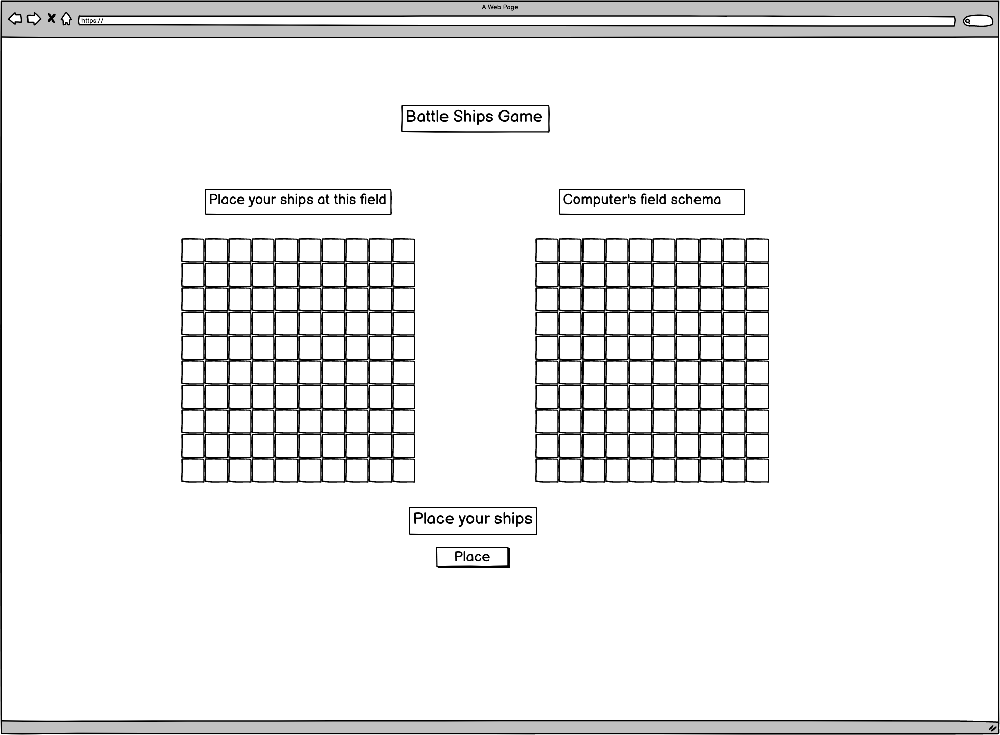
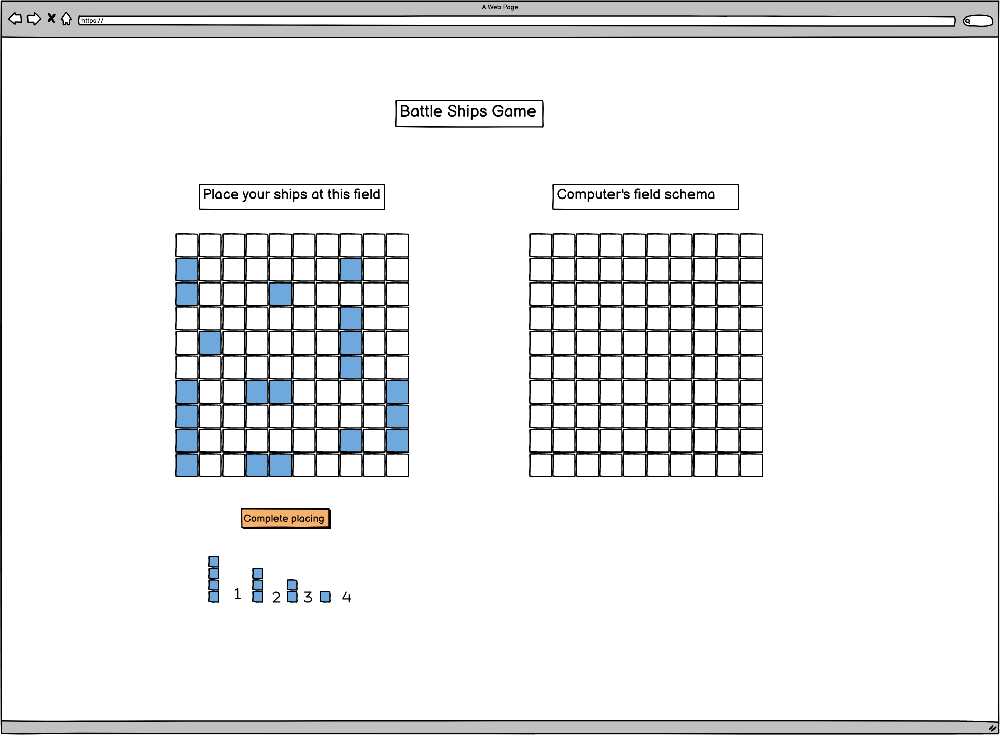
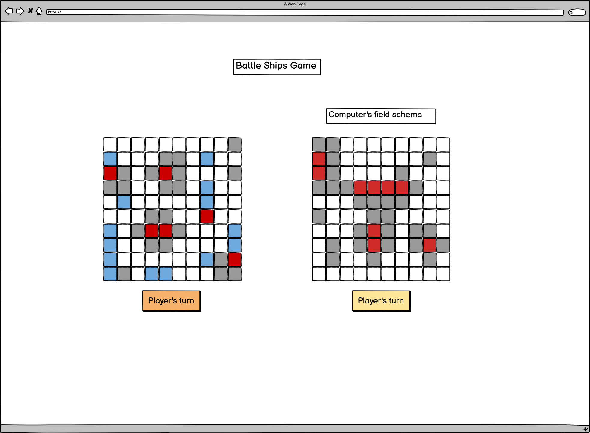
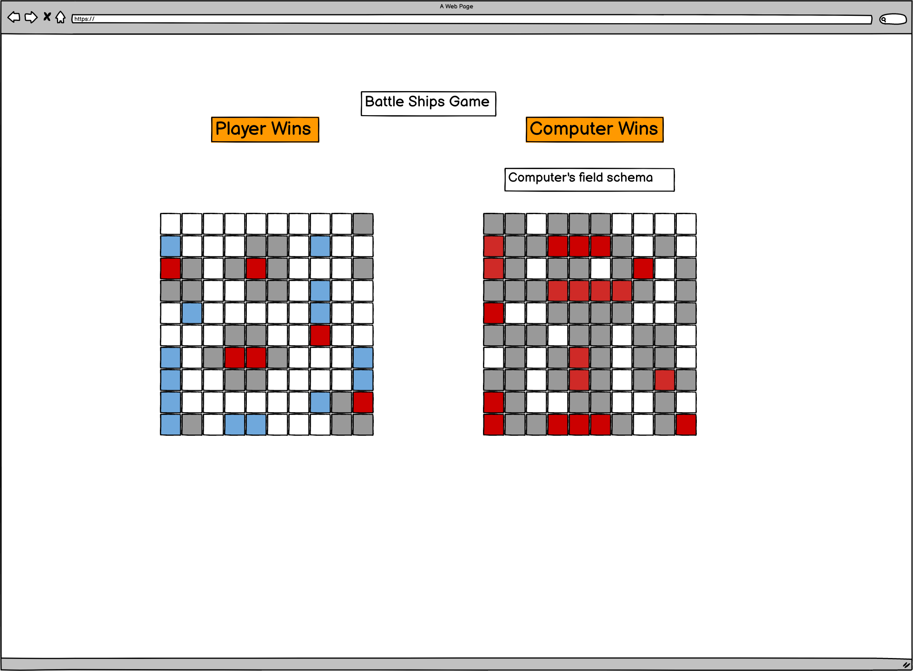

# **Project: Battleship game.**

## Description: 
Battleship is a strategy type guessing game for two players (In this game second player is a computer). It is played on ruled grids on which each player's fleet of warships are marked. The locations of the fleets are concealed from the other player. Players alternate turns calling "shots" at the other player's ships, and the objective of the game is to destroy the opposing player's fleet. 
The game is played on four grids, two for each player. The grids are 10×10 – and the individual squares in the grid are identified by letter from "A" to "J" and number from 1 to 10. On one grid the player arranges ships and records the shots by the opponent. On the other grid, the player records their own shots.

Before play begins, each player secretly arranges their ships on their primary grid. Each ship occupies a number of consecutive squares on the grid, arranged either horizontally or vertically. The number of squares for each ship is determined by the type of ship. The ships cannot overlap (i.e., only one ship can occupy any given square in the grid) or touch another ships. At least 1 square distance is required between any ships. The types and numbers of ships allowed are the same for each player. The ships should be hidden from players sight and it's not allowed to see each other's pieces. The game is a discovery game which players need to discover their opponents ship positions.

### Names and Size of the ships using in this version of the game


| Name           | Size        |Num Of ships |
| -------------- | ----------- |-------------|
| Battleship     | 4 squares   | 1           |
| Cruiser        | 3 squares   | 2           |             
| Submarine      | 2 squares   | 3           |
| Destroyer      | 1 square    | 4           |

<hr>

## Screen views


### The main screen of the game represents the begining of the game before the user prompted to place their ships on the user's field.


&nbsp;  

### The screen in the end of placing the ships by user. Represents the possible situation of the ships according to the schema of number and size of ships. <br/> There is a size of at least one square between ships. After user placed all the ships the check is going to run to verify that all the ships placed according to the rule.


&nbsp;  
### The screen of the playing process. Shows destroyed ships of the players indicated in red color. Also the missing shots indicated in gray color. <br/>Also screen shows plaques indicating which turn it is now.


&nbsp;  
### The screen represents how the game ends. It represents that all the computer ships are destroyed and the plaque "Player wins" appears. <br/>The screen also demonstrates how the plaque "Computer wins" will look like in case computer wins.


&nbsp;  

<hr>

## User stories


### MVP
#### Pseudocode
1. As a user I want to be able to start a game by pressing start game button 
```
    Create a button "Start Game" in HTML and add Event Listener to it to a function that starts game game()
    Randomly select who starts by using Math.random and if value > 0 and value < 0.5 start user
    else start computer
    if (Math.random() > .5) {
        user starts
    } else {
        computer starts
    }
```

2. As a user I want to have two game fields: one for setting up my ships and for computer's shoots, and another one to show user's shoots.
```
    Create the gaming fields and store them as an objects at two variables - userField and actionField
    Create a list of header "a", "b", "c" till "j" for iterating through the fields objects
    Create function that generates user's Field and Action field on the screen in HTML
    iterate through user's object by using list of headers 
    for i in object.header[j] add div element to HTML document container
    add to the div element event listener for click function to change colors depending on action and assign value to corresponding variable.
```
3. As a user I want to be able to set up my battleships on the first game field  
```
    Assign value equal to the ship - "[_]|" to the usersField object's corresponding cell by clicking on the actual userField cell.
```
4. As a user I want computer to generate computer's side ships on the actionField and check that ships situated according to the rules
``` 
    Creating a list of headers for iterating through the field object 
    const liters = ["a", "b", "c", "d", "e", "f", "g", "h", "i", "j"]
    creating random namber for positioning second x or y coordinate in the way it doesn't take cells beyond the field length
    const ranNum = Math.random() * (length of the field - length of the ship)

    Make function to situate ships on the action field
    function situateShip = (field, lenOfShip) => {
        //situate ship vertically
        if (Math.random() > .5) {
            for (i=start; i<length of the ship; i++) {
                field[liters[i]][ranNum] = "[_]|"
            }

        } else {
            //situate ship horizontally
            for (i=start; i<length of the ship; i++){
             field[liters[ranNum]][i] = "[_]|"
        }
    }
    Before situating ships on the field run the check that verifies cells don't already contain other ships in the cells by iterating through them before
    use the same structure as for placing the ships but in that case just verifying that on the whole length there is no occupied cells 
    for (i=start; i<length of the ship; i++) {
        if (cell !== " _ |"){
        call shituateShip(field, lenOfShip) function
        }    
    }
    
```
5. As a user I want to see all my hits and misses and hit ships of opponent computer's as well on the second game field 
```
    Create function of representing on the screen elements on the user's field and action field's object
    iterate through the fields and if element in the object === empty cell make corresponding cell on the screen 

    When user clicks on the action field cell depends 
    if (cell's value === "[_]|") {
        cell's value = "[x]|"
    } 
    Cell with value = "[x]|" should turn red on the screen.

    After each turn need to verify that at least on ship not destroyed for that iterate through the action or userField 
    and verify that at least 1 cell of a ship still not damaged. For rendering that function should be created - const verifyGameStatus = (field) => { 
    for (i = 0; i<liters.length; i++){
        for (j = 0; j<field[liters[i]].length; ++){
            if (field[liters[i]][j] === "[_]|"){
                return true
            }
        }
    }
    return false
    }

    if the function returns false after user's or computer's turn the game should be stopped and the plaque "user wins" or "computer wins" should appear on the screen
    if (verifyGameStatus(field) !== true) {
        document.querySelector(".info-cell").innerHTML = "${player} wins"
    }
```
6. As a user I want to see opponent computer's hits and misses on my field. 
``` 
    const nextTarget
    For computer's shoots need to create a function compShoot() that selects randomly cell as a target.
    const target = field[liters[Math.random()*10]][Math.random()*10]
    if (target equal to "[_]|") {
       make target equal to "[x]|"
       // assigning value of a successful target to the varialbe nextTarget to make next move from that point
       nextTarget = target
    } else if (target not equal empty cell ) {
        move target to one cell up and then to the next row
    } else {
        make target equal to miss sign "o"
    }

    if target was successful next hit of the computer should aim to the cell close to previous target
    
```
7. As a user I want to see which turn is it now.
```
    Run function that indicates which turn is now
    function turnNow(player) that adds innerHTML to the plaque on the HTML page 
    document.querySelector(".playerTurn").innerHTML = "${user} turn" 
```

8. As a user I want to see when the game is over and who has won.
```
    After running function gameStatus() after each turn when it returns false, it means no player's ships left whole it means that other player has won.
    Change plaque on the HTML field that player (user or computer) won.
    document.querySelector(".game-status").innerHTML = "Player won"

```
9. As a user I want to be able to restart game.
```
    Assign event listener to a button on HTML page that calls function start game.
```
10. As a user I want to have both battle fields colored light blue, missed fires as a dot, ships a dark gray color, destroyed ships as a red color.
```
    Add corresponding styles to css
```
&nbsp;  
<hr>

### Version 2.
It would be nice to have a theme picture on the main page and useful menu
It would be nice to have a page with rules described

&nbsp;  
<hr>

### Version 3.
It would be nice to have sounds of blasts if hit or misses.