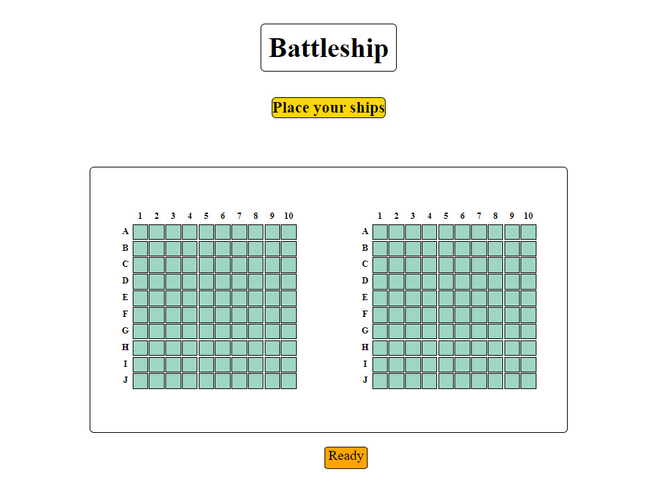
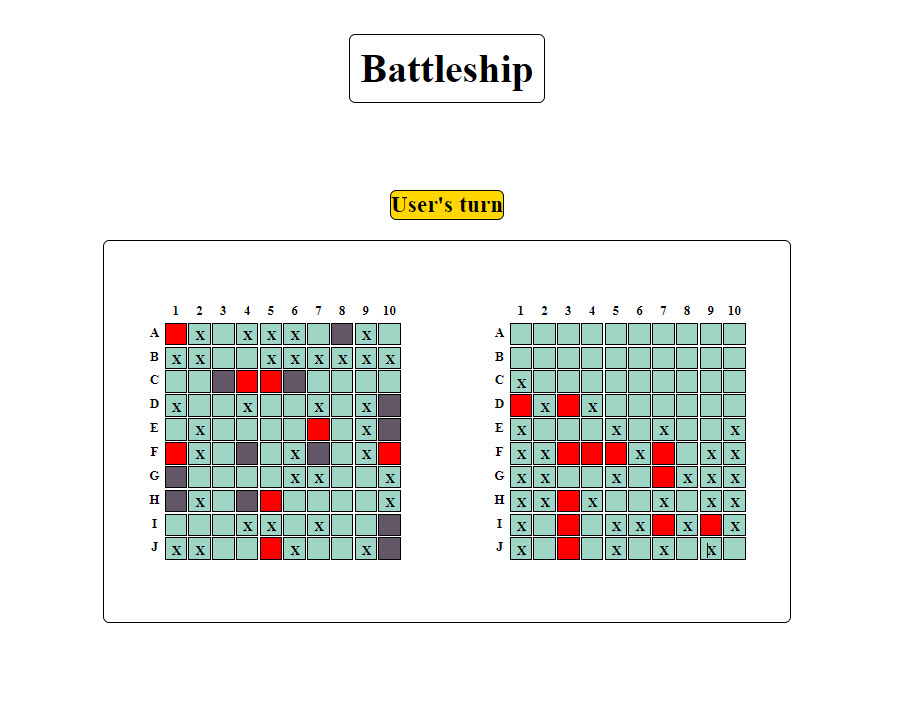
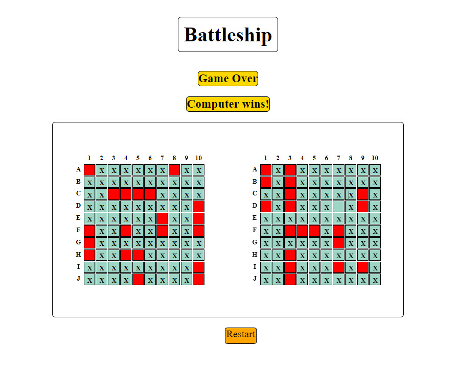

# **Battleship**

## Description: 
Battleship is a strategy type guessing game for two players (In this game second player is a computer). It is played on ruled grids on which each player's fleet of warships are marked. The locations of the fleets are concealed from the other player. Players alternate turns calling "shots" at the other player's ships, and the objective of the game is to destroy the opposing player's fleet. 
The game is played on four grids, two for each player. The grids are 10×10 – and the individual squares in the grid are identified by letter from "A" to "J" and number from 1 to 10. On one grid the player arranges ships and records the shots by the opponent. On the other grid, the player records their own shots.

Before play begins, each player secretly arranges their ships on their primary grid. Each ship occupies a number of consecutive squares on the grid, arranged either horizontally or vertically. The number of squares for each ship is determined by the type of ship. The ships cannot overlap (i.e., only one ship can occupy any given square in the grid) or touch another ships. At least 1 square distance is required between any ships. The types and numbers of ships allowed are the same for each player. The ships should be hidden from players sight and it's not allowed to see each other's pieces. The game is a discovery game which players need to discover their opponents ship positions.

### Names and Size of the ships using in this version of the game

| Name           | Size        |Num Of ships |
| -------------- | ----------- |-------------|
| Battleship     | 4 squares   | 1           |
| Cruiser        | 3 squares   | 2           |             
| Submarine      | 2 squares   | 3           |
| Destroyer      | 1 square    | 4           |

&nbsp;  

&nbsp;  

&nbsp;  

&nbsp;  

## **Technology Used**

The followind technology was used in order to create Battleship:

* JavaScript

* HTML

* CSS

## **Getting Started**

To play this game live you can click this [link](https://testingrange.github.io/Battleship-game/) &nbsp;

Instructions:

* On the left hand field place your ships by clicking on the game field's cells
* Place your ships according to the schema in the description part and it is also put in pop up messeges above the game fields
* Put ships' cells next to each other without spaces 
* Keep at least on cell distance between ships (do not place them next to each other without space between them.)
* If you made a mistake just click on the cell once again to remove that cell
* When all set of ships is placed (Look at the picture Ship placement) click on the Ready button
* After Ready button was clicked no changes to shipt placement can be done
* When it's prompted that user's turn - take your shoot at the right hand active field
* Make your actions at turns with computer
* The first who destroys all the ships of the opponet is the winner
* Click on Restart button to restart the game

## **Next Steps**

### Version 2:

* As a user I want to have a theme picture on the main page and useful menu
* As a user I want to have a page with rules described
* As a user I want computer targeting improved
* As a user I want to implement a function of verifying the correctness of user's ships placement 
* As a user I want the statistics of the game to be implemented on the screen

### Version 3:

* As a user I want to have a theme picture on the main page and useful menu
* As a user I want to have a page with rules described
